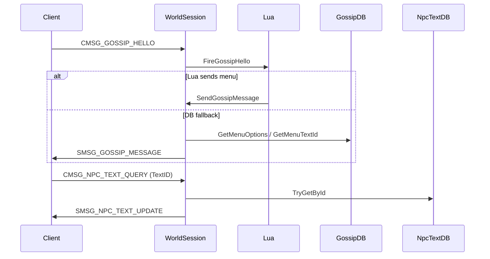

# NPC gossip and `npc_text`

Cataclysm **4.3.4** gossip: database-driven menus, dialog copy, Lua hooks, and wire packets aligned to WowPacketParser / firelands-cata-ref.

**Tracking:** [docs/ES/ROADMAP.md](../../ES/ROADMAP.md) (workspace snapshot, parity matrix, bitácora).

---

## Shipped (`d5b48b1`) — NPC gossip menus

**Commit:** `d5b48b1` — `feat(world): implement NPC gossip menus`

### What it does

When a player talks to a creature (`CMSG_GOSSIP_HELLO`):

1. **Lua first** — `IGameScriptHost::FireGossipHello` (`gossip_hello`). Scripts can call `SendGossipMessage` and set `_gossipMenuSent`.
2. **Database fallback** — if Lua did not send a menu, load `creature_template.gossip_menu_id` (or menu `0` for role shortcuts), filter options by `npcflag`, send `SMSG_GOSSIP_MESSAGE`.
3. **Close** — if nothing was sent, `SMSG_GOSSIP_COMPLETE` so the client does not hang.

`CMSG_GOSSIP_SELECT_OPTION` fires `gossip_select` in Lua, then supports **chained menus** via `gossip_menu_option_action.ActionMenuId`, else closes gossip.

Quest lines in `SMSG_GOSSIP_MESSAGE` come from `creature_queststarter` / `creature_questender` via `BuildAllGossipQuestItemsForPlayer` (Cataclysm wire: id, icon, level, flags, blue?, title).

### Opcodes and packets

| Direction | Opcode | Builder / handler |
|-----------|--------|-------------------|
| C→S | `CMSG_GOSSIP_HELLO` (0x4525) | `WorldSession::HandleGossipHello` |
| C→S | `CMSG_GOSSIP_SELECT_OPTION` (0x0216) | `WorldSession::HandleGossipSelectOption` |
| S→C | `SMSG_GOSSIP_MESSAGE` | `gossip::BuildGossipMessage` — full `uint64` NPC GUID (not packed) |
| S→C | `SMSG_GOSSIP_COMPLETE` | `gossip::BuildGossipComplete` |

Client target GUID for gossip uses **8-byte** `ObjectGuid` (`ReadClientTargetGuid` in `WorldSessionObjectUpdate`).

### Domain and application

| Piece | Path |
|-------|------|
| Menu model | `src/domain/models/GossipMenu.h` |
| Port | `src/domain/repositories/IGossipRepository.h` |
| Template lookup (menu id, npcflag) | `src/domain/repositories/INpcTemplateSearchRepository.h` |
| Menu id + npcflag filter | `src/application/logic/GossipLogic.h` |
| DB send helper | `src/infrastructure/network/sessions/worldsession/WorldSessionGossip.cpp` |

### Infrastructure

| Piece | Path |
|-------|------|
| MySQL adapter | `src/infrastructure/persistence/MySqlGossipRepository.{h,cpp}` |
| Packet builders | `src/infrastructure/network/sessions/worldsession/GossipPackets.h` |
| Handlers | `worldsession/WorldSessionClientHandlers.cpp` |
| Wiring | `src/world/WorldApplication.cpp` (`MySqlGossipRepository`, template search) |

### World SQL (committed with feature)

| Migration | Purpose |
|-----------|---------|
| `31_world_creature_template_gossip_menu_id.sql` | `creature_template.gossip_menu_id` |
| `32_world_gossip_tables.sql` | DDL: `gossip_menu`, `gossip_menu_option`, `gossip_menu_option_action`, `gossip_menu_option_box` |
| `35_world_gossip_data.sql` | Data (generate: `python3 tools/sql/import_ref_gossip.py`) |

### Tests

- `tests/unit/application/GossipLogicTests.cpp`
- `tests/unit/domain/GossipMenuTests.cpp`
- `tests/unit/infrastructure/GossipPacketTests.cpp`
- `tests/unit/shared/WowGuidTests.cpp` (creature entry from unit GUID)

### GM tooling (same commit)

`.npc search <fragment>` prints styled template matches in system chat (`GmNpcSearchPrintResults`); helps find creatures to test gossip menus.

### Reference

Verify packet layout and menu behaviour against local clone `firelands-cata-ref/` (build 15595), e.g. `PlayerMenu::SendGossipMenu`, `SGossipOptions`.

---

## In progress — `npc_text` (dialog copy)

**Status:** local changes **not yet committed** (as of 2026-05-18).

Gossip menus reference a **text id** (`gossip_menu.TextID`). The client issues `CMSG_NPC_TEXT_QUERY` and expects `SMSG_NPC_TEXT_UPDATE` with eight text slots (probability, two strings, language, three emotes each).

### Planned behaviour

`WorldSession::SendNpcTextForGossipWindow` (also used from `HandleNpcTextQuery`):

1. Load row via `INpcTextRepository::TryGetById` when wired.
2. On miss, use `NpcText::MakeFallback(textId)` (default greeting `Greetings $N`).
3. Send `gossip::BuildNpcTextUpdate(payload)`.

After `SMSG_GOSSIP_MESSAGE`, the server **pushes** npc text immediately when `textId != 0` (15595 clients often never send `CMSG_NPC_TEXT_QUERY` otherwise).

### New / touched code (WIP)

| Piece | Path |
|-------|------|
| Model | `src/domain/models/NpcText.h` |
| Port | `src/domain/repositories/INpcTextRepository.h` |
| MySQL adapter | `src/infrastructure/persistence/MySqlNpcTextRepository.{h,cpp}` |
| Packet builder | `src/infrastructure/network/sessions/worldsession/NpcTextPackets.h` |
| Handler | `WorldSessionClientHandlers.cpp` (`HandleNpcTextQuery`) |
| Opcode | `CMSG_NPC_TEXT_QUERY` (0x4E24) in `WorldOpcodes.h` |
| Tests | `tests/unit/domain/NpcTextTests.cpp`; extended `GossipPacketTests.cpp` |

### World SQL (WIP)

| Migration | Purpose |
|-----------|---------|
| `33_world_npc_text.sql` | DDL: reference-compatible `npc_text` |
| `34_world_npc_text_data.sql` | Data: `python3 tools/sql/import_ref_npc_text.py` |

After migrations land, regenerate bundled world schema (`merge-migrations`) and refresh Docker bundle per `AGENTS.md`.

### Done criteria (before closing WIP)

- [ ] Commit domain + infra + migrations + tests
- [ ] Run import scripts if data files are not in repo
- [ ] Regenerate `sql/bundled/firelands_world.sql`
- [ ] Manual: NPC with known `TextID` shows correct dialog body in client (not only fallback)

### Quest lines in gossip (shipped)

| Migration | Purpose |
|-----------|---------|
| `36_world_quest_gossip_tables.sql` | DDL: `quest_template`, `creature_queststarter` |
| `38_world_quest_gossip_data.sql` | Full starters: `python3 tools/sql/import_ref_quest_gossip.py` |
| `40_world_quest_gossip_allowable_masks.sql` | Backfill class/race masks if `38` ran before columns existed (auto-generated with import) |

### Quest overhead markers (! / ?)

The client requests `CMSG_QUESTGIVER_STATUS_QUERY` / `CMSG_QUESTGIVER_STATUS_MULTIPLE_QUERY`; the server answers with `SMSG_QUESTGIVER_STATUS` / `_MULTIPLE` (uint64 guid + uint32 cata status flags, e.g. `0x100` = available). Starter NPCs keep template gossip + quest-giver `UNIT_NPC_FLAGS` (flight master bit stripped). Interaction: `CMSG_QUESTGIVER_HELLO` and/or `CMSG_GOSSIP_HELLO` → gossip menu or `SMSG_QUESTGIVER_QUEST_LIST`.

Starter visibility uses per-character quest status plus `quest_template.PrevQuestId` (ref `quest_template_addon.PrevQuestID`: positive = previous quest must be **rewarded**; negative = previous must be **active**). Chain starters that fail the prev check are **omitted** from gossip / quest list (not grey). Too-low level shows **grey** (`QUEST_ICON_UNAVAILABLE`). Lines are filtered by `AllowableClasses` / `AllowableRaces` and `QuestLevel` vs player level. Echo Isles example: Zen'Tabra (38243) turn-in for 24764 shows **?** when complete; chain starters such as 24765 stay hidden until 24764 is turned in. Apply migrations `67`/`68` (or re-import gossip data with `PrevQuestId`) so chain data exists in `quest_template`. Meet-objective quests with no trackable counters auto-complete when the end NPC is opened or enters quest-giver status range. Turning in a quest clears the matching `PLAYER_QUEST_LOG_*` slot on the client via `SMSG_UPDATE_OBJECT` (ref `SetQuestSlot(slot, 0)`), in addition to `SMSG_QUESTGIVER_QUEST_COMPLETE`.

### Quest accept / complete (MVP)

- `CMSG_QUESTGIVER_QUERY_QUEST` → `SMSG_QUESTGIVER_QUEST_DETAILS` (`LogTitle`, `QuestDescription` body, `LogDescription` objectives)
- DB: migration `63` (columns) + `64_world_quest_gossip_text_data.sql` (text backfill from ref). Regenerate: `python3 tools/sql/import_ref_quest_gossip.py --out sql/migrations/64_world_quest_gossip_text_data.sql --backfill-text-only`
- Accept updates `PLAYER_QUEST_LOG_*` via values update (no `SMSG_QUEST_UPDATE_COMPLETE` until objectives finish)
- `CMSG_QUESTGIVER_ACCEPT_QUEST` / `CMSG_QUESTGIVER_COMPLETE_QUEST` wired; progress in `PlayerQuestProgressStore` (session memory + dirty save on accept/turn-in, flush on logout)
- Quest gossip rows are cached per creature entry; auto-accept on query skips DB save until accept or logout
- `RefreshPlayerPhaseVisibilityFromQuestProgress()` after accept, meet-complete, and turn-in
- Autocomplete-flag quests (`QUEST_FLAGS_AUTOCOMPLETE`) finish on accept
- Persist accept/complete/reward to `character_queststatus` / `character_queststatus_rewarded` on dirty save (`PersistQuestProgressForCharacter`), load on login (`LoadQuestProgressForCharacter`), flush on logout

### Not in this slice yet

- `BroadcastTextID*` columns stored but not used server-side yet
- Full `quest_template` reward block in details / turn-in packets (wire uses zeroed `QuestRewards` block)

---

## End-to-end flow (with `npc_text` complete)

---

## Lua integration

Hooks are documented in [LUA_SCRIPTING.md](../LUA_SCRIPTING.md). Scripts run **before** the DB fallback on hello; they must set the session gossip-sent flag when calling `GossipSendMenu` (wired through `WorldSession` / script host).

---

## Related commands and docs

- GM commands: [gm-administration.md](gm-administration.md) (`.npc search`)
- Database layout: [DATABASE_SCHEMA.md](../DATABASE_SCHEMA.md#gossip-and-npc_text-world)
- Import tools: `AGENTS.md` → Migrations / bundled schema
